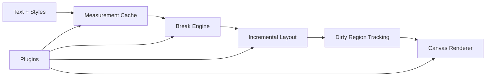

<div align="center">
  <h1>ByeText</h1>
  <p><strong>A canvas-first text runtime built for obstacle-aware layout, incremental updates, and plugin-driven behavior.</strong></p>
  <p>ByeText is designed to go beyond a striking demo. It aims to be a dependable engine for interactive typography, spatial text systems, and real-time layout experiments that need to stay fast under motion.</p>
</div>

<p align="center">
  
</p>

<div align="center">
  <table>
    <tr>
      <td><strong>Canvas-first</strong></td>
      <td><strong>Incremental relayout</strong></td>
      <td><strong>Obstacle-aware flow</strong></td>
      <td><strong>Plugin architecture</strong></td>
    </tr>
    <tr>
      <td>Single-canvas text rendering with deterministic measurement.</td>
      <td>Dirty-range layout and redraw instead of full recompute on every change.</td>
      <td>True line splitting around obstacles, including center gaps inside a paragraph.</td>
      <td>Typed extension points for flow, motion, debug, selection, bidi, and more.</td>
    </tr>
  </table>
</div>

## Why ByeText

Most experimental text demos prove that responsive typography can look interesting. ByeText is meant to prove that it can also be structured, extensible, and production-minded.

This repository focuses on the pieces that make an interactive text engine robust:

- cached text measurement keyed by normalized style and content
- prefix-sum line fitting and binary-search width checks
- incremental layout that starts from the first dirty line and searches for a stable tail
- dirty-region rendering that avoids repainting the entire surface
- typed plugin hooks instead of ad hoc patching
- benchmark scenarios and tests that cover layout, rendering, editing, and obstacle flow

If a viral prototype sparks the idea, ByeText is the part that tries to make the idea durable.

## What Ships Today

| Area | Status | Notes |
| --- | --- | --- |
| Core runtime | Implemented | Measurement, line breaking, layout, rendering, incremental edit support, public API |
| Flow plugin | Implemented | Circle obstacles, side-aware padding, split-gap line constraints |
| Motion plugin | First pass | Animation scheduling and state helpers |
| Debug plugin | Scaffolded | Inspection-oriented extension point surface |
| Selection plugin | Scaffolded | Selection facade and future interaction work |
| Bidi / grapheme / emoji | Scaffolded | Reserved packages for text-completeness work |
| Benchmarks | Implemented | Cold layout, typing, bulk insert, width resize, scroll render, obstacle move |
| Demo | Implemented | Real ByeText browser demo using the actual TypeScript source |

## Demo

The repository includes a browser demo that uses the real core and flow plugin source rather than a mocked standalone script.

```bash
pnpm demo
```

Then open:

- [http://127.0.0.1:4173/examples/obstacle/index.html](http://127.0.0.1:4173/examples/obstacle/index.html)

What the demo proves:

- text can reflow around a moving obstacle without collapsing the whole line to one side
- characters remain visible on both sides of a centered obstacle when space allows
- canvas backing-store updates survive browser zoom and DPR changes
- resizing remains fluid while the obstacle and text layout continue to update

## Quick Start

### Install dependencies

```bash
pnpm install
```

### Run tests

```bash
pnpm test
```

### Run benchmarks

```bash
pnpm bench
```

### Start the interactive demo

```bash
pnpm demo
```

## Minimal API Example

```ts
import { ByeText } from './packages/core/src/api.ts'
import { createFlowPlugin } from './packages/plugins/flow/src/index.ts'

const flow = createFlowPlugin()
const doc = ByeText.create({
  canvas,
  text: 'Hello from ByeText.',
  width: 480,
  height: 320,
  font: { family: 'Iowan Old Style', size: 18 },
  plugins: [flow]
})

const obstacleId = flow.addObstacle(
  { type: 'circle', cx: 220, cy: 120, r: 28 },
  { padding: 18, side: 'both' }
)

doc.render()

flow.updateObstacle(obstacleId, { cx: 250, cy: 140, r: 28 })
doc.render()
```

## Architecture At A Glance



Core responsibilities:

- `measure.ts`: canvas measurement with cache reuse and deterministic lookup keys
- `break.ts`: token segmentation, prefix sums, binary-search fitting, and multi-segment line support
- `layout.ts`: full and incremental relayout, spatial queries, and line indexing
- `render.ts`: dirty-region redraw, DPR-aware canvas synchronization, and span painting
- `plugin.ts`: typed lifecycle hooks for measure, break, layout, render, motion, and edit integration

## Package Map

| Path | Purpose |
| --- | --- |
| `packages/core` | Main text engine with document state, line breaking, layout, rendering, and API |
| `packages/plugins/flow` | Obstacle-aware layout constraints and reflow helpers |
| `packages/plugins/motion` | Motion-oriented scheduling and state helpers |
| `packages/plugins/debug` | Debug surface for inspection-oriented tooling |
| `packages/plugins/bench` | Benchmark support hooks |
| `packages/plugins/selection` | Selection facade scaffold |
| `packages/plugins/bidi` | Future bidirectional text support |
| `packages/plugins/grapheme` | Future grapheme-cluster correctness work |
| `packages/plugins/emoji` | Future emoji-aware layout work |
| `packages/byetext` | Meta-package that re-exports the core and plugin entry points |
| `benchmarks` | Repeatable scenario runners |
| `examples` | Browser-facing demos and starter embeddings |
| `docs` | Architecture, API, plugin, performance, and migration notes |

## Robustness Priorities

ByeText is intentionally biased toward the concerns that make advanced text systems hold up under pressure:

### 1. Layout correctness under motion

- obstacle constraints can create multiple available segments on a single line
- centered obstacles create real gaps inside the text flow rather than shifting the full line away
- the demo exercises continuous obstacle movement and live resize in the same surface

### 2. Incremental work instead of full resets

- edits mark dirty ranges rather than discarding the whole document state
- relayout begins at the first affected line and searches for a stable downstream boundary
- rendering clears and redraws only the regions that changed

### 3. Rendering stability

- DPR-aware canvas sync prevents zoom-related text disappearance
- measurement is isolated behind a cache and stable font keys
- the render path compares span geometry to avoid unnecessary paint work

### 4. Extensibility without runtime patchwork

- plugins integrate through typed extension points
- optional behavior is isolated into plugin packages instead of hard-coded branches
- scaffolds already exist for future completeness work such as bidi, emoji, selection, and debugging

## Testing And Benchmarking

Current automated coverage in the core test suite includes:

- measurement cache behavior
- cache eviction
- width fitting
- full document breaking
- split-gap obstacle flow
- spatial layout queries
- basic rendering
- incremental edit relayout

The benchmark runner currently times:

- first layout
- insert typing
- bulk insert
- width resize
- scroll render
- obstacle move

These are not meant as polished marketing benchmarks yet; they are here to keep performance work grounded in repeatable scenarios.

## Repository Layout

```text
.
|-- assets/
|   `-- demo.gif
|-- benchmarks/
|-- docs/
|-- examples/
|   `-- obstacle/
|-- packages/
|   |-- byetext/
|   |-- core/
|   `-- plugins/
|-- package.json
|-- pnpm-workspace.yaml
`-- turbo.json
```

## Documentation

- [Architecture](./docs/architecture.md)
- [API](./docs/api.md)
- [Plugins](./docs/plugins.md)
- [Performance](./docs/performance.md)
- [Migration](./docs/migration.md)
- [Obstacle example notes](./examples/obstacle/README.md)

## Roadmap

- Expand text-completeness work for bidi, grapheme clusters, and emoji handling
- Grow the motion and selection packages from scaffolds into full interaction layers
- Add deeper benchmark reporting and regression tracking
- Formalize higher-level editor primitives on top of the current document core
- Publish stable package packaging and release metadata

## Publishing Notes

This repository is already organized to present well on GitHub:

- the root README now doubles as a landing page
- the demo GIF lives in `assets/demo.gif` for immediate visual context
- the repo has a root `.gitignore` for a clean first publish
- the obstacle demo can be launched with `pnpm demo`

If you initialize Git in this directory, the project is in a good state for a first public push.
